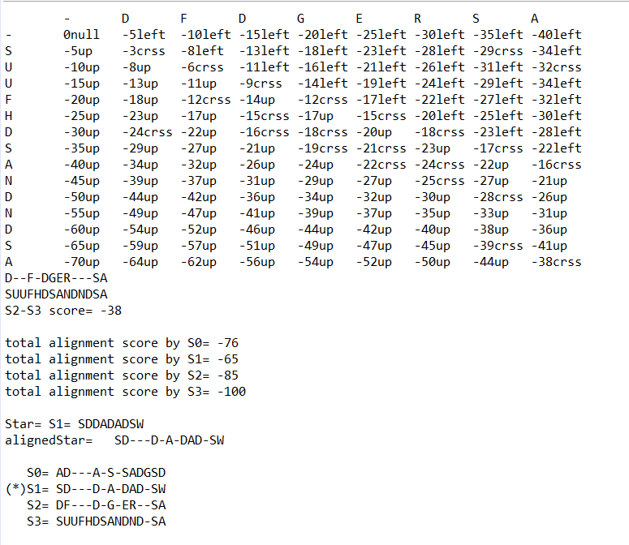

# Bioinformatic Star Algorithm
This project finds star sequence and align them with global alignment by considering the star sequence between the given sequences.

## Output
Shows user the alignment and score between each 2 sequences and after finding the star, align them all by considering the star sequnces like the given sample view below. You can see each points and best ways on each table.

